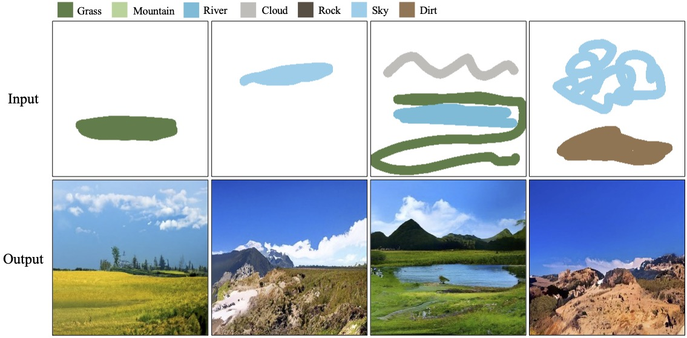

# Diffusion-based_Semantic_Image_Synthesis_from_Sparse_Layouts

Code for the paper "Diffusion-based Semantic Image Synthesis from Sparse Layouts" (CGI 2023)

Check out our [project page](https://sky24h.github.io/websites/cgi2023_sis-from-sparse-layouts) for more details.


# Dependencies
See requirements.txt

# Pre-trained Models
**Original checkpoint** used to evaluate the model in the paper can be downloaded from [here](https://drive.google.com/file/d/1itvW-a3Fuo4aVMSuf48KugPSzD34MoMP/view?usp=drive_link).
This ckpt takes 1024 steps to generate images, which can be very slow.

For a faster inference speed and slightly lower quality, please download a distilled checkpoint that only require 32 steps, from [here](https://drive.google.com/file/d/1-PROe_nZuIXpNa7309rcS1Z2sVHF0Ogj/view?usp=drive_link).


# How to Use
```
python sample.py --checkpoint "path/to/checkpoint"
```

Generated images will be saved in the "results" folder.


# Citing
```
@inproceedings{Huang2023Sparse,
author={Huang, Yuantian and Iizuka, Satoshi and Fukui, Kazuhiro},
title={Diffusion-based Semantic Image Synthesis from Sparse Layouts},
booktitle={Computer Graphics International Conference},
year={2023},
organization={Springer},
}
```
